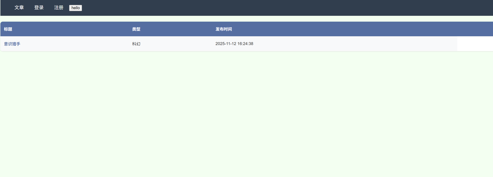
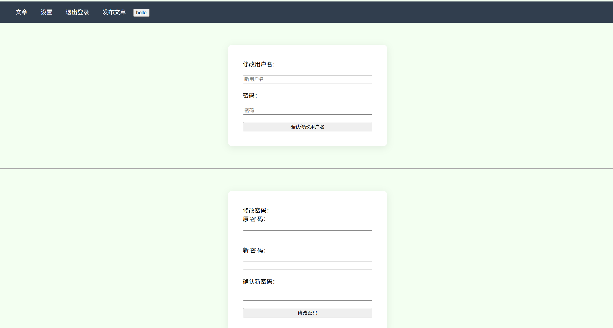
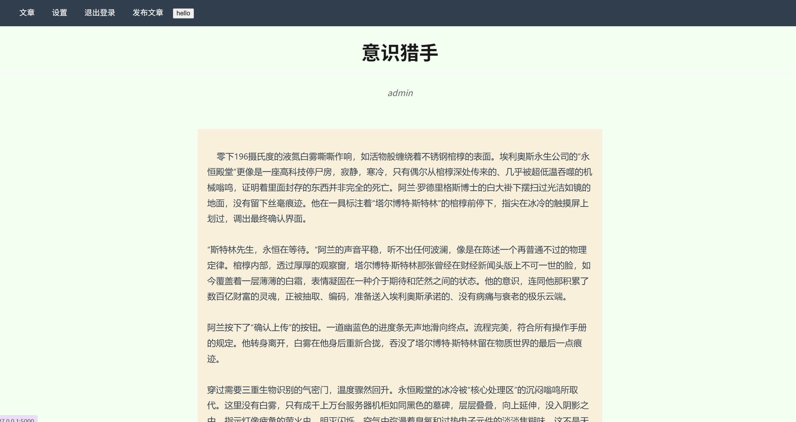

#simple-personal-blog

###项目介绍
一个基于flask的入门博客系统，包含前台和后台，

###功能介绍

#####前台功能：
* 文章展示​：浏览所有文章列表，点击标题查看完整内容
* 用户系统​：用户注册、登录、退出功能
* 个人设置​：登录后可修改用户名和密码
* 交互体验：改变背景颜色(点击hello按钮)

#####后台管理
* 文章管理：发布新文章，删除现有文章

###技术栈
* 前端：html，css，JavaScript
* 后端：flask，python
* 数据库：SQLite
* 会话管理：flask_session
* 安全：werkzeug 密码加密
* 开发工具：部分css样式使用ai辅助生成

###快速开始
1. 环境要求：python3.6及以上，pip
2. 安装依赖：终端运行pip install flask flask_session
3. 运行flask run 自动生成‘blog.db’文件(用于存储用户和文章数据)和管理员账号
4. 浏览器访问终端出现的链接
5. 登录管理员账号用户名：admin 密码：helloworld
6. 进入设置修改初始密码

###应用截图

主页

设置

文章
